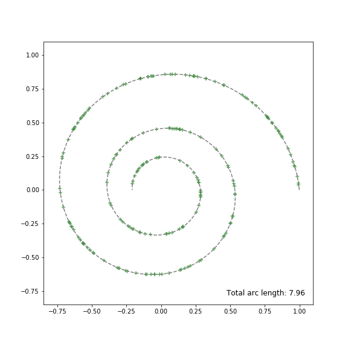
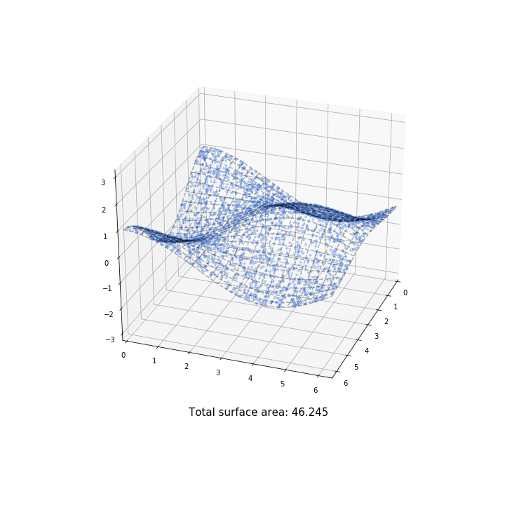

This module contains several functions useful for evaluating integrals and generating random points on parametric curves and surfaces.

Author: [Max Kapur](maxkapur.com).

### Examples

Generate uniformly distributed random points along a parametric curve:

Generate uniformly distributed random points on a parametric surface:

Please see the Jupyter notebook `examples.ipynb` or its HTML counterpart for workflow examples.

### Calculating arc lengths and surface areas

`arc_cumulator()` and `surface_cumulator()` take data coordinates as input and return the arc length or area accumulated at each point. The convenience functions `arc_length()` and `surface_area()` return the total arc length or surface area over the given region. The precision arguments determine how many subintervals will be evaluated.

### Generating random data

The functions `r_arc()` and `r_surface()`, and their counterparts `r_arc_from_data()` and `r_surface_from_data()`, let you generate random points that are uniformly distributed with respect to the arc length of a parametric curve or the area of a parametric surface.

For a curve given by a parametric function `func(t)` for a certain range of t-values, use `r_arc(n, func, t0, t1)`. For a surface given by a parametric function `func(t,u)` for a range of t- and u-values, use `r_surface(n, func, t0, t1, u0, u1)`.  The parameter space must be rectangular.

For a curve given by a list of point coordinates and (optionally) corresponding t-values, use `r_arc_from_data(n, t, coords)`. For a curve given by a grid of point coordinates and (optionally) corresponding t- and u-values, use `r_surface_from_data(n, t, u, coords)`, where the input is best formatted like a numpy meshgrid. In these functions, Scipy's interpolation functions are used to return points on the surface; the interpolation method may be controlled by the `kind` parameter.

Mathematically, the procedure for sampling a random point on an arc given by `f(t)` on `[t0, t1]` is as follows: 

 1. Numerically compute the total arc length `P`.
 2. Pick a random number `s` on `[0,P)`. 
 3. Determine, by interpolation, `t` such that the arc length on `[t0, t]` is `s`.
 4. Return `f(t)`.
 
For a surface given by `f(t, u)`, the process is similar: 

 1. Numerically compute the total area `A`. 
 2. Independently pick two random numbers `S1` and `S2` on `[0,A)`.
 3. Determine, by interpolation, t such that the surface area on `[t0,t], [u0,u1]` is `S1`.
 4. Determine, by interpolation, u such that the surface area on `[t0, t1], [u0,u]` is `S2`.
 5. Return `f(t, u)`.
 
### Acknowledgements
The following Stack Exchange discussions were of assistance in creating this module:

 - [Generate random points on perimeter of ellipse](https://math.stackexchange.com/questions/3710402/generate-random-points-on-perimeter-of-ellipse/3718774#3718774) (Math SE)
 - [Generate random points on perimeter of ellipse](https://codereview.stackexchange.com/questions/243590/generate-random-points-on-perimeter-of-ellipse/243697?noredirect=1#comment478326_243697) (Code Review SE)